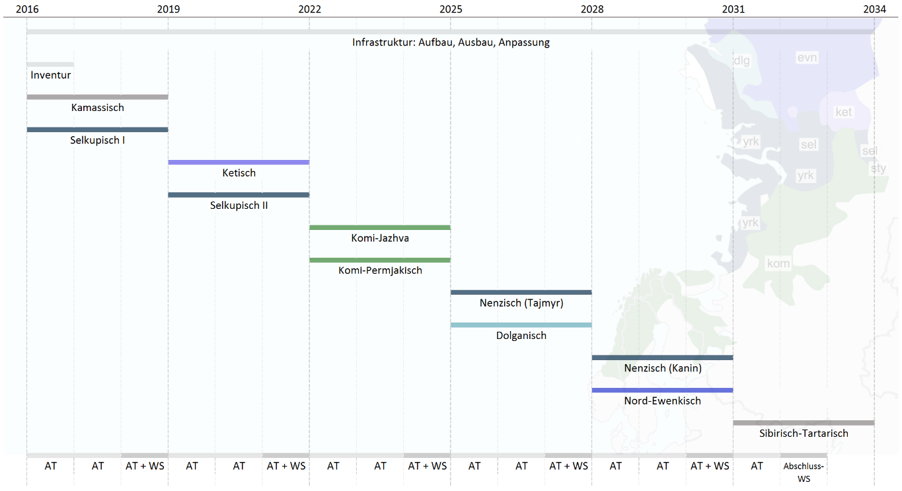
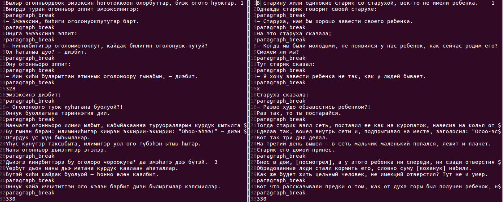
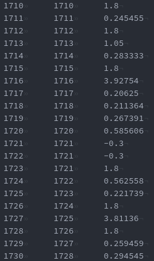
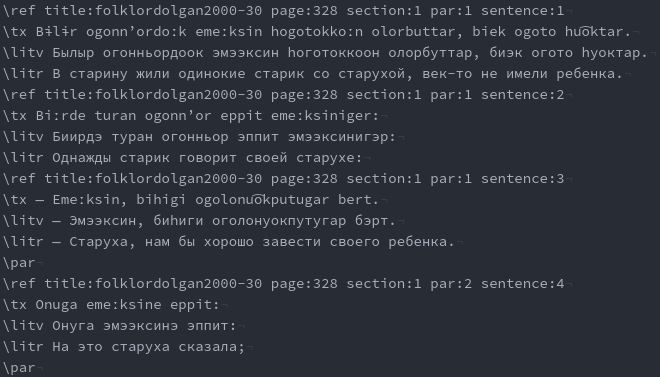
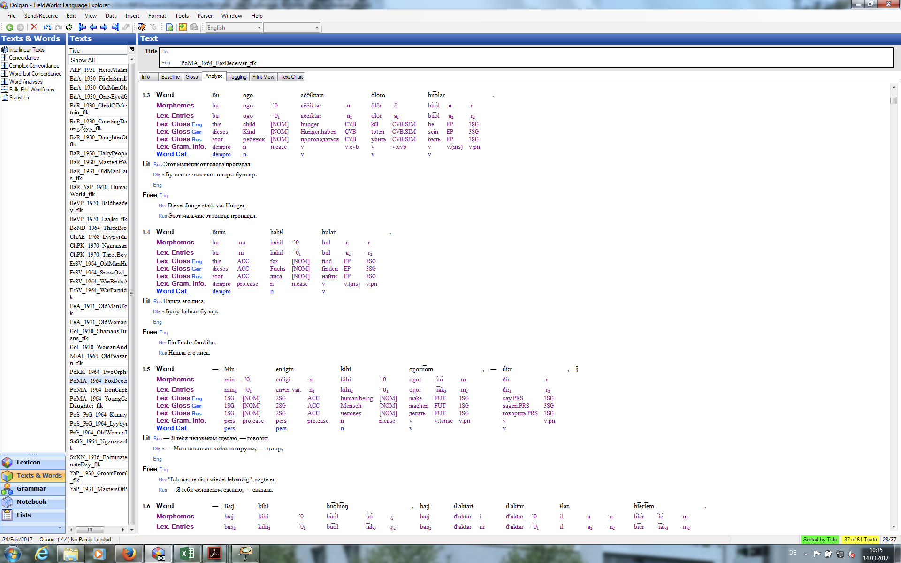
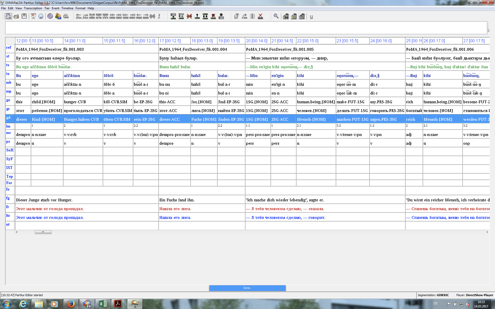
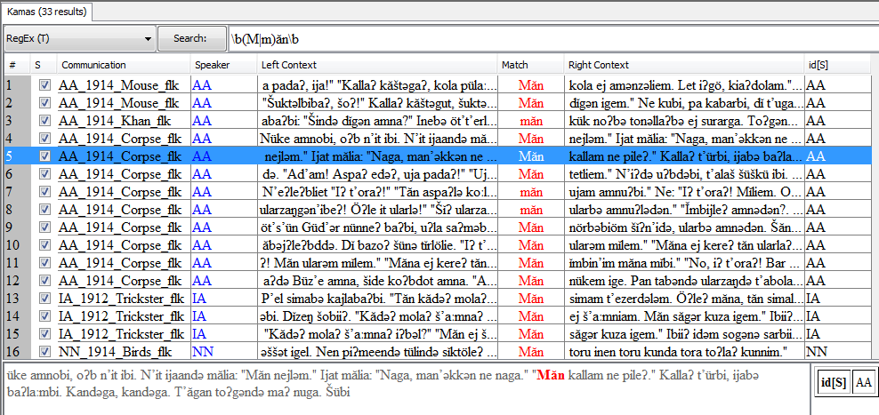
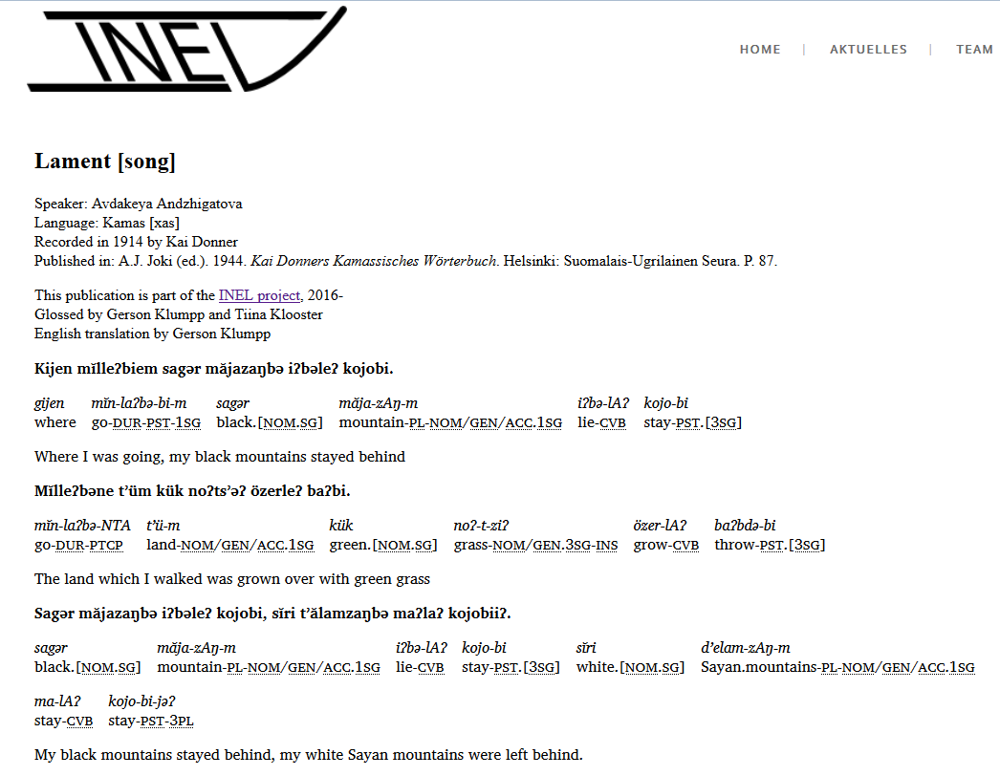

```{r setup, include=FALSE}
knitr::opts_chunk$set(echo = FALSE)
```

## INEL

- Grammars, corpora and language technologies for Indigenous Northern Eurasian Languages ([website](https://inel.corpora.uni-hamburg.de/))
- A long-term project (18 years) funded by Academy of Sciences and Humanities in Hamburg
- The project was applied for by Prof. Dr. Beáta Wagner-Nagy, Dr. Michael Riessler and the management of HZSK
- Research:
    - Institut für Finnougristik / Uralistik at Universität Hamburg (IFUU)
- Infrastructure:
    - Hamburger Zentrum für Sprachkorpora ([HZSK](https://corpora.uni-hamburg.de/hzsk/))

## {.flexbox .vcenter}

```{r, out.width = "800px", fig.align='center'}

```

## Data first phase

- Kamas
    - Kamassisches Wörterbuch (Donner, 1944), glossing complete
    - Audio from last speaker, currently being transcribed
- Selkup
    - A.I. Kuzmina's archive at IFUU: field notes, recordings…
- **Dolgan**
    - Texts from existing publications (folklore)
    - Audio recordings from different sources

## Pecularities of Dolgan case

- Variety of transcription systems
    - Transliterated to INEL conventions
- Some printed publications rather new
    - High print quality, easy OCR
- Sentence-level translation to Russian
    - Need for aligning
    - Russian translations often in internet already

## Basics of INEL OCR workflow

### Tools used

- We have been using ABBYY Finereader
- First goal is to bring texts into FLEx with metadata
    - Toolbox file as interchange format
- Audio is aligned later in EXMARaLDA
- Git is used as version control across work phases
    - Most relevant in EXMARaLDA stage
- Hunalign has been practical in alignment checking

## {.flexbox .vcenter}

### Overview to the current workflow

## {.flexbox .vcenter}

```{r, out.width = "760px"}
knitr::include_graphics("images/abbyy_basic.png")
```

## {.flexbox .vcenter}

```{r, out.width = "760px"}
knitr::include_graphics("images/abbyy_overview.png")
```

## {.flexbox .vcenter}

```{r, out.width = "760px"}

```

## {.flexbox .vcenter}



[hunalign](https://github.com/mrorii/hunalign)

## {.flexbox .vcenter}

```{r, out.width = "760px"}

```

## {.flexbox .vcenter}

```{r, out.width = "760px"}

```

## {.flexbox .vcenter}

```{r, out.width = "760px"}

```

## {.flexbox .vcenter}

```{r, out.width = "800px"}

```


## {.flexbox .vcenter}

```{r, out.width = "600px"}

```

## Paradox with ABBYY

### Desktop version

- Good user interface
- Training new models easy, although not transparent
- Practical to do fast post-correction after OCR
- **No XML export**

### Engine version

- Used from command line
- Only pre-defined models
- Cannot be post-corrected in Abbyy Desktop
- Good ALTO XML export

## {.flexbox .vcenter}

```{r, out.width = "800px"}
knitr::include_graphics("images/abbyy_overview.png")
```

##

### How is this possible?

- In defence of ABBYY, other OCR tools suffer with same
- Maybe it simply is difficult to manage user edits and word/letter position coordinates?

### Currently lost information

- Coordinate information on page
- Some formatting
- Footnotes are later added manually as notes
- Time is wasted!

## Why is this a problem? (1/2)

- Reconstructing paragraphs from plain text very unreliable
    - Word coordinate on page gives more cues
- Distinguishing different numberings from one another hard
    - Page numbers, chapter numbers etc.
- Accurate page information nice for citations

## Why is this a problem? (2/2)

- No chances to deal with more complex layout in the document
- Hard to make nice ebooks automatically!
    - Ebooks with broken paragraph structure annoying to read
- Hard to make nice digital facsimiles!
    - Relevant for older and rarer items

- Unnecessary information loss is never desirable!

## Future tasks

### Combining text and coordinates

- Text files in some collections are nicely corrected
- XML files contain coordinate info
    - It must be possible to do matching between these two files?

### Combining corpora for research purposes

- Same speakers and writers (Albert Vanejev, Jevgeni Igušev)

##

</br></br>
</br></br>
</br></br>
<center>Аттьӧ! Thank you! Спасибо!</center>
</br></br>
<center>CC-BY -- Niko Partanen / INEL -- 2017</center>
</br></br>
<center>More information and publication [here](https://github.com/nikopartanen/syktyvkar2017).</center>

<!--
---

class: inverse, center, middle
 
# Glimpse to handwritten text recognition

---

background-image: url(0001.jpg)

---

## State of the art

- Not yet used in INEL


- Current tools demand 50-100 pages of training data
    - Compare to the average size of one dataset
    
    
- Models are additive, so different handwritings help one another
    - Not tested yet, but probably more character set then language specific
    - Training a model for Scientific Komi Transcription a worthy goal
    
    
- Some tools proprietary, open source lags bit behind
    - Training data naturally free and can be reused
-->    

